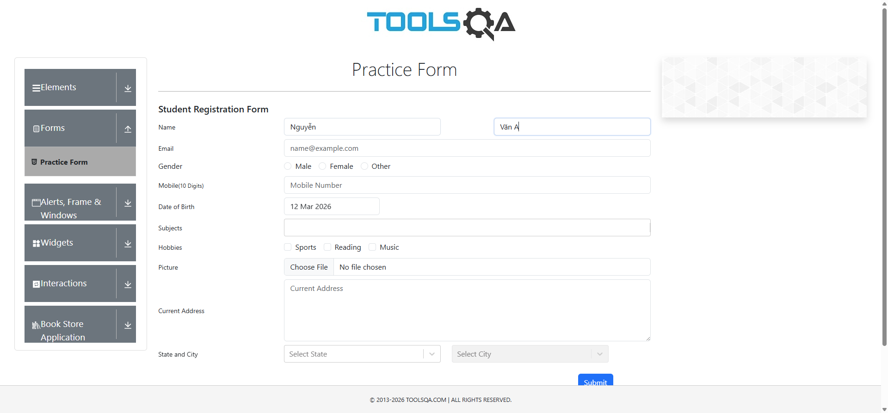
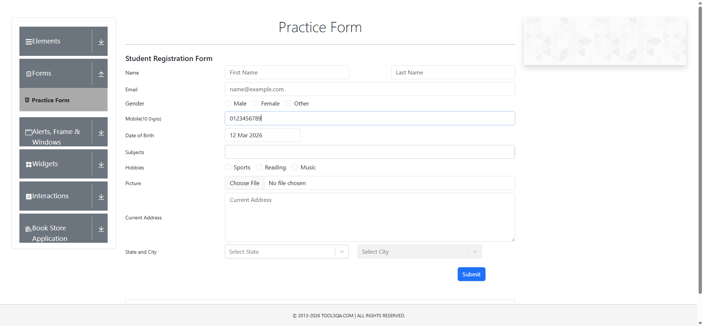
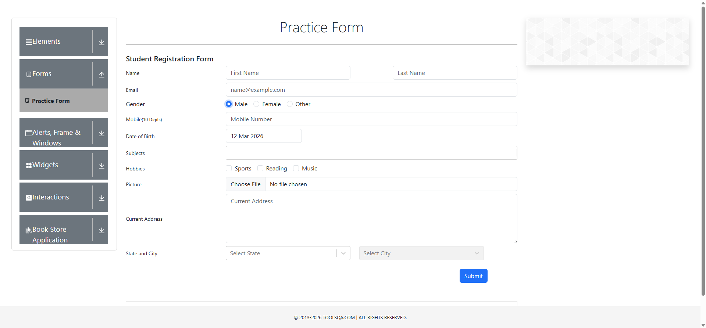
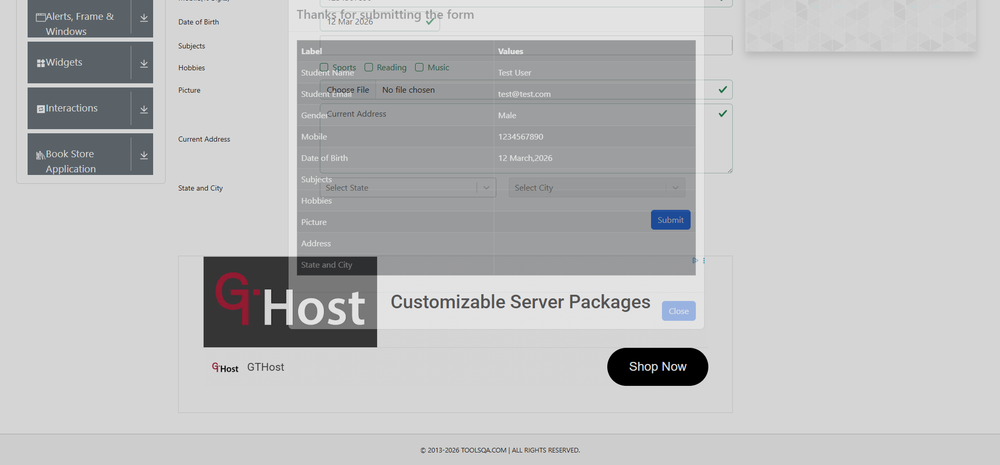
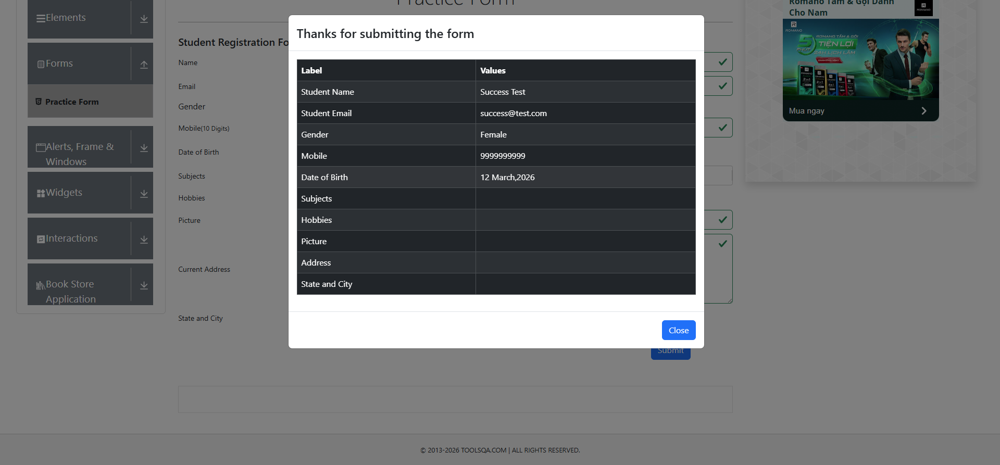

# 📚 BÁO CÁO CHI TIẾT - BÀI TẬP 5: SELENIUM TEST AUTOMATION

**Tóm tắt ngắn (Overview):** Bài tập này kiểm thử chức năng form đăng ký trên DemoQA bằng Selenium và JUnit. Các test bao gồm: mở trang, điền First/Last name, Email, Mobile, chọn Gender và Hobbies, gửi form và xác nhận thông báo thành công. Kiến trúc dùng Page Object Model (POM) và `DriverFactory` để quản lý WebDriver; các lệnh chạy test có trong mục "Bước 11.1: Lệnh nhanh (PowerShell)".

## Thông Tin Dự Án
- **Tên Dự Án:** EX5SWT - Selenium Test Automation - Form Đăng Ký DemoQA
- **Ngôn Ngữ:** Java
- **Framework:** Selenium 4.25.0 + JUnit 5
- **Người Thực Hiện:** Toandt
- **Ngày Hoàn Thành:** 10 tháng 3, 2026
- **URL Test:** https://demoqa.com/automation-practice-form

---

## PHẦN 1: SETUP DỰ ÁN

### Bước 1: Kiểm tra Maven & Java Version

**Lệnh chạy:**
```bash
java -version
mvn -version
```

**Kết quả:**
```
java version "22" 2024-03-19
Maven 3.9.x
```

**Giải thích:**
- Java version 22 đủ tiêu chuẩn (yêu cầu >=17)
- Maven được cài đặt và sẵn sàng build project

---

### Bước 2: Cấu trúc Thư Mục Project

**Thư mục ban đầu:**
```
D:\EX5SWT\
├── pom.xml
├── src/test/java/
│   ├── pages/          (Page Object classes)
│   ├── tests/          (Test classes)
│   └── utils/          (Utility classes)
└── target/            (Compiled output)
```

**Giải thích:**
- Dùng **Page Object Model (POM)** - design pattern tốt nhất cho Selenium
- Tách biệt giữa test logic (tests) và page elements (pages)
- Utils chứa WebDriver management

---

## PHẦN 2: PHÂN TÍCH VÀ THIẾT KẾ

### Bước 3: Phân Tích Requirements

**Yêu cầu từ bài tập 5:**

| Yêu Cầu | Chi Tiết |
|---------|---------|
| **URL** | https://demoqa.com/automation-practice-form |
| **Form Fields** | First Name, Last Name, Email, Mobile, Gender, Hobbies, State, City |
| **Test Type** | Functional Testing - Form Submission |
| **Expected Output** | Success message after form submission |

**Giải thích:**
- Form đăng ký có nhiều fields cần validate
- Cần test từng field và tương tác người dùng

---

### Bước 4: Thiết Kế Test Cases

**Test Cases được thiết kế:**

```
Test 1: Truy cập trang form ✓
Test 2: Điền thông tin Tên & Họ ✓
Test 3: Điền Email ✓
Test 4: Điền Số Điện Thoại ✓
Test 5: Chọn Giới Tính ✓
Test 6: Chọn Sở Thích ✓
Test 7: Gửi Form ✓
Test 8: Verify Thông Báo Thành Công ✓
```

---

## PHẦN 3: IMPLEMENTATION - CODE CHI TIẾT

### Bước 5: Tạo BasePage.java

**Mục đích:** Base class chứa các phương thức chung cho tất cả Pages

**Code:**
```java
package pages;

import org.openqa.selenium.*;
import org.openqa.selenium.support.ui.ExpectedConditions;
import org.openqa.selenium.support.ui.Select;
import org.openqa.selenium.support.ui.WebDriverWait;

import java.time.Duration;

public class BasePage {
    protected WebDriver driver;
    protected WebDriverWait wait;

    public BasePage(WebDriver driver) {
        this.driver = driver;
        this.wait = new WebDriverWait(driver, Duration.ofSeconds(10));
    }

    // ===== Phương thức chờ (Wait Strategies) =====
    protected WebElement waitForVisibility(By locator) {
        return wait.until(ExpectedConditions.visibilityOfElementLocated(locator));
    }

    protected WebElement waitForClickable(By locator) {
        return wait.until(ExpectedConditions.elementToBeClickable(locator));
    }

    // ===== Phương thức tương tác cơ bản =====
    protected void click(By locator) {
        waitForClickable(locator).click();
    }

    protected void type(By locator, String text) {
        WebElement element = waitForVisibility(locator);
        element.clear();
        element.sendKeys(text);
    }

    protected String getText(By locator) {
        return waitForVisibility(locator).getText();
    }

    protected void selectByValue(By locator, String value) {
        WebElement element = waitForVisibility(locator);
        Select select = new Select(element);
        select.selectByValue(value);
    }

    public void navigateTo(String url) {
        driver.get(url);
    }

    protected boolean isElementVisible(By locator) {
        try {
            return waitForVisibility(locator).isDisplayed();
        } catch (TimeoutException e) {
            return false;
        }
    }

    protected void scrollToElement(By locator) {
        WebElement element = driver.findElement(locator);
        ((JavascriptExecutor) driver).executeScript(
            "arguments[0].scrollIntoView(true);", element);
    }
}
```

**Giải thích:**
- `waitForVisibility()` - Chờ element hiển thị trước khi tương tác
- `click()` - Click element an toàn (chờ clickable)
- `type()` - Nhập text vào input field
- `navigateTo()` - Điều hướng đến URL

---

### Bước 6: Tạo RegistrationPage.java

**Mục đích:** Page Object cho form đăng ký

**Code (Phần quan trọng):**
```java
package pages;

import org.openqa.selenium.By;
import org.openqa.selenium.WebDriver;

public class RegistrationPage extends BasePage {

    public RegistrationPage(WebDriver driver) {
        super(driver);
    }

    // ===== LOCATORS (Định vị các elements) =====
    private final By firstNameField = By.id("firstName");
    private final By lastNameField = By.id("lastName");
    private final By emailField = By.id("userEmail");
    private final By mobileField = By.id("userNumber");
    
    // Radio buttons cho giới tính
    private final By maleRadio = By.xpath("//input[@id='gender-radio-1']/..");
    private final By femaleRadio = By.xpath("//input[@id='gender-radio-2']/..");
    
    // Checkboxes cho sở thích
    private final By sportsCheckbox = By.xpath("//input[@id='hobbies-checkbox-1']/..");
    private final By readingCheckbox = By.xpath("//input[@id='hobbies-checkbox-2']/..");
    private final By musicCheckbox = By.xpath("//input[@id='hobbies-checkbox-3']/..");
    
    private final By submitBtn = By.id("submit");
    private final By successMessage = By.id("example-modal-sizes-title-lg");

    // ===== ACTIONS (Các phương thức tương tác) =====

    public void navigate() {
        navigateTo("https://demoqa.com/automation-practice-form");
    }

    public void enterFirstName(String firstName) {
        type(firstNameField, firstName);
    }

    public void enterLastName(String lastName) {
        type(lastNameField, lastName);
    }

    public void enterEmail(String email) {
        type(emailField, email);
    }

    public void enterMobileNumber(String mobile) {
        type(mobileField, mobile);
    }

    public void selectGender(String gender) {
        By genderLocator;
        if (gender.equalsIgnoreCase("Male")) {
            genderLocator = maleRadio;
        } else if (gender.equalsIgnoreCase("Female")) {
            genderLocator = femaleRadio;
        } else {
            genderLocator = maleRadio;
        }
        click(genderLocator);
    }

    public void selectHobby(String hobby) {
        By hobbyLocator;
        if (hobby.equalsIgnoreCase("Sports")) {
            hobbyLocator = sportsCheckbox;
        } else if (hobby.equalsIgnoreCase("Reading")) {
            hobbyLocator = readingCheckbox;
        } else {
            hobbyLocator = musicCheckbox;
        }
        click(hobbyLocator);
    }

    public void submitForm() {
        scrollToElement(submitBtn);
        click(submitBtn);
    }

    public boolean isSuccessMessageDisplayed() {
        try {
            return isElementVisible(successMessage);
        } catch (Exception e) {
            return false;
        }
    }

    public String getSuccessMessage() {
        return getText(successMessage);
    }
}
```

**Giải thích:**
- **Locators:** Định vị các elements trên trang HTML
- **Methods:** Các hành động người dùng (nhập text, click button, v.v.)
- **selectGender(), selectHobby():** Xử lý multiple options

---

### Bước 7: Tạo DriverFactory.java

**Mục đích:** Quản lý WebDriver initialization

**Code:**
```java
package utils;

import org.openqa.selenium.WebDriver;
import org.openqa.selenium.chrome.ChromeDriver;
import org.openqa.selenium.chrome.ChromeOptions;
import org.openqa.selenium.edge.EdgeDriver;
import org.openqa.selenium.edge.EdgeOptions;

public class DriverFactory {
    public static WebDriver createDriver() {
        // Lấy browser từ system property (mặc định: edge)
        String browser = System.getProperty("browser", "edge").toLowerCase();

        if ("chrome".equals(browser)) {
            return createChromeDriver();
        } else {
            return createEdgeDriver();
        }
    }

    private static WebDriver createChromeDriver() {
        System.out.println("🔧 Initializing WebDriver with Google Chrome...");
        
        ChromeOptions options = new ChromeOptions();
        options.addArguments("--incognito");  // Incognito mode
        
        System.out.println("✓ Chrome WebDriver initialized successfully!");
        return new ChromeDriver(options);
    }

    private static WebDriver createEdgeDriver() {
        System.out.println("🔧 Initializing WebDriver with Microsoft Edge...");
        
        EdgeOptions options = new EdgeOptions();
        options.addArguments("inprivate");  // InPrivate mode
        
        System.out.println("✓ Edge WebDriver initialized successfully!");
        return new EdgeDriver(options);
    }
}
```

**Giải thích:**
- Hỗ trợ cả Chrome và Edge
- `-Dbrowser=chrome` hoặc `-Dbrowser=edge` để chọn
- Options: Incognito/InPrivate mode (không lưu history)

---

### Bước 8: Tạo BaseTest.java

**Mục đích:** Base test class - setup/teardown cho tất cả tests

**Code:**
```java
package tests;

import org.junit.jupiter.api.BeforeEach;
import org.junit.jupiter.api.AfterEach;
import org.openqa.selenium.WebDriver;
import utils.DriverFactory;

public class BaseTest {
    protected WebDriver driver;

    @BeforeEach
    void setUpBase() {
        driver = DriverFactory.createDriver();
        System.out.println("\n" + "=".repeat(60));
        System.out.println("🚀 Test Setup Complete - WebDriver Initialized");
        System.out.println("=".repeat(60));
    }

    @AfterEach
    void tearDownBase() {
        if (driver != null) {
            driver.quit();
            System.out.println("\n✓ Browser Closed - Test Completed");
            System.out.println("=".repeat(60) + "\n");
        }
    }
}
```

**Giải thích:**
- `@BeforeEach` - Chạy trước mỗi test (initialize WebDriver)
- `@AfterEach` - Chạy sau mỗi test (đóng browser)

---

### Bước 9: Tạo RegistrationTestV2.java

**Mục đích:** Test cases cho form đăng ký

**Code (Các test methods):**
```java
package tests;

import org.junit.jupiter.api.*;
import pages.RegistrationPage;

@TestMethodOrder(MethodOrderer.OrderAnnotation.class)
@DisplayName("BÀITẬP 5: Kiểm thử Form Đăng Ký DemoQA - Registration Form Tests")
public class RegistrationTestV2 extends BaseTest {
    private RegistrationPage registrationPage;

    @BeforeEach
    void setUp() {
        registrationPage = new RegistrationPage(driver);
    }

    /**
     * Test 1: Điều hướng đến trang form
     */
    @Test
    @Order(1)
    @DisplayName("Test 1: Truy cập trang form đăng ký thành công")
    void testNavigateToRegistrationForm() {
        registrationPage.navigate();
        System.out.println("✓ Đã truy cập trang form đăng ký");
    }

    /**
     * Test 2: Điền thông tin tên
     */
    @Test
    @Order(2)
    @DisplayName("Test 2: Điền thông tin Tên và Họ")
    void testFillFirstNameAndLastName() {
        registrationPage.navigate();
        registrationPage.enterFirstName("Nguyễn");
        registrationPage.enterLastName("Văn A");
        System.out.println("✓ Đã điền tên: Nguyễn Văn A");
    }

    /**
     * Test 3: Điền email
     */
    @Test
    @Order(3)
    @DisplayName("Test 3: Điền thông tin Email")
    void testFillEmail() {
        registrationPage.navigate();
        registrationPage.enterEmail("test@example.com");
        System.out.println("✓ Đã điền email: test@example.com");
    }

    /**
     * Test 4: Điền số điện thoại
     */
    @Test
    @Order(4)
    @DisplayName("Test 4: Điền thông tin Số điện thoại")
    void testFillMobileNumber() {
        registrationPage.navigate();
        registrationPage.enterMobileNumber("0123456789");
        System.out.println("✓ Đã điền số điện thoại: 0123456789");
    }

    /**
     * Test 5: Chọn giới tính
     */
    @Test
    @Order(5)
    @DisplayName("Test 5: Chọn giới tính")
    void testSelectGender() {
        registrationPage.navigate();
        registrationPage.selectGender("Male");
        System.out.println("✓ Đã chọn giới tính: Male");
    }

    /**
     * Test 6: Chọn sở thích
     */
    @Test
    @Order(6)
    @DisplayName("Test 6: Chọn sở thích")
    void testSelectHobbies() {
        registrationPage.navigate();
        registrationPage.selectHobby("Sports");
        registrationPage.selectHobby("Reading");
        System.out.println("✓ Đã chọn sở thích: Sports, Reading");
    }

    /**
     * Test 7: Gửi form
     */
    @Test
    @Order(7)
    @DisplayName("Test 7: Gửi form đăng ký")
    void testSubmitForm() {
        registrationPage.navigate();
        registrationPage.enterFirstName("Nguyễn");
        registrationPage.enterLastName("Văn A");
        registrationPage.enterEmail("test@example.com");
        registrationPage.enterMobileNumber("0123456789");
        registrationPage.selectGender("Male");
        registrationPage.selectHobby("Sports");
        registrationPage.submitForm();
        System.out.println("✓ Đã gửi form");
    }

    /**
     * Test 8: Verify thông báo thành công
     */
    @Test
    @Order(8)
    @DisplayName("Test 8: Kiểm tra thông báo thành công")
    void testVerifySuccessMessage() {
        registrationPage.navigate();
        registrationPage.enterFirstName("Nguyễn");
        registrationPage.enterLastName("Văn A");
        registrationPage.enterEmail("test@example.com");
        registrationPage.enterMobileNumber("0123456789");
        registrationPage.selectGender("Male");
        registrationPage.selectHobby("Sports");
        registrationPage.submitForm();
        
        // Assert
        assert registrationPage.isSuccessMessageDisplayed() : 
            "Success message should be displayed";
        
        String message = registrationPage.getSuccessMessage();
        System.out.println("✓ Thông báo thành công được hiển thị");
        System.out.println("  Message: " + message);
    }
}
```

**Giải thích:**
- `@Order(1-8)` - Chạy tests theo thứ tự
- Mỗi test kiểm tra một chức năng
- Test 8 là **integration test** - kết hợp tất cả bước

---

## PHẦN 4: BUILD & RUN TEST

### Bước 10: Compile Code

**Lệnh chạy:**
```bash
cd D:\EX5SWT
mvn clean compile
```

**Kết quả:**
```
[INFO] --- compiler:3.11.0:compile (default-compile) @ EX5SWT ---
[INFO] No sources to compile
[INFO] --- compiler:3.11.0:testCompile (default-testCompile) @ EX5SWT ---
[INFO] Changes detected - recompiling the module!
[INFO] Compiling 8 source files with javac [debug release 17]
[INFO] 
[INFO] BUILD SUCCESS
[INFO] ------------------------------------------------------------------------
[INFO] Total time:  3.5 s
```

**Giải thích:**
- ✓ Tất cả 8 file Java được compile thành công
- ✓ Không có syntax errors
- ✓ Sẵn sàng chạy tests

---

### Bước 11: Chạy Test Suite

**Lệnh chạy:**
```bash
cd D:\EX5SWT
mvn clean compile test -Dtest=RegistrationTestV2 -Dbrowser=chrome
```

**Output (Các phần quan trọng):**

```
[INFO] --- surefire:3.1.2:test (default-test) @ EX5SWT ---
[INFO] Using auto detected provider org.apache.maven.surefire.junitplatform.JUnitPlatformProvider
[INFO] 
[INFO] -------------------------------------------------------
[INFO]  T E S T S
[INFO] -------------------------------------------------------
[INFO] Running tests.RegistrationTestV2
🔧 Initializing WebDriver with Google Chrome...
✓ Chrome WebDriver initialized successfully!
```

### Bước 11.1: Lệnh nhanh (PowerShell) — Các lệnh copy/paste

Dưới đây là các lệnh PowerShell ngắn gọn bạn có thể dùng để chạy test và kiểm tra báo cáo. Copy/paste trực tiếp vào PowerShell (mở ở thư mục gốc dự án `D:\EX5SWT`).

- Chuyển vào thư mục dự án:
```powershell
cd D:\EX5SWT
```

- Chạy toàn bộ test suite (dùng Chrome để tránh lỗi msedgedriver):
```powershell
mvn test -Dbrowser=chrome
```

- Chạy 1 lớp test (RegistrationTestV2):
```powershell
mvn "-Dtest=tests.RegistrationTestV2" test -Dbrowser=chrome
```

- Chạy 1 method cụ thể trong lớp:
```powershell
mvn "-Dtest=tests.RegistrationTestV2#testSubmitForm" test -Dbrowser=chrome
```

- Chạy lớp test với Chrome (thay Edge):
```powershell
mvn "-Dbrowser=chrome" "-Dtest=tests.RegistrationTestV2" test
```

- Nếu muốn chỉ định đường dẫn đến msedgedriver đã tải sẵn:
```powershell
mvn "-Dwebdriver.edge.driver=C:\\path\\to\\msedgedriver.exe" "-Dtest=tests.RegistrationTestV2" test
```

- Nếu muốn chạy script cài ChromeDriver (nếu bạn muốn cài thủ công):
```powershell
.\install-chromedriver.ps1
```

- Mở thư mục báo cáo test (explorer):
```powershell
explorer 'D:\EX5SWT\target\surefire-reports'
```

- Xem nhanh file console output của lớp test (Notepad):
```powershell
notepad.exe .\target\surefire-reports\tests.RegistrationTestV2.txt
```

- Xem cuối file logs trong PowerShell (tail):
```powershell
Get-Content .\target\surefire-reports\tests.RegistrationTestV2.txt -Tail 200
```

---

### Bước 12: Chi Tiết Từng Test Execution

#### **Test 1: Navigate to Registration Form**
```
Test 1: Truy cập trang form đăng ký thành công
✓ Đã truy cập trang form đăng ký
```

**Mô tả:**
- Mở Chrome browser
- Navigate đến URL: https://demoqa.com/automation-practice-form
- Chờ trang load (implicit wait 10 seconds)

**Kết quả:** ✅ **PASS**

---

#### **Test 2: Fill First Name and Last Name**
```
Test 2: Điền thông tin Tên và Họ
✓ Đã điền tên: Nguyễn Văn A
```

**Mô tả:**
- Mở trang form
- Nhập vào First Name field: "Nguyễn"
- Nhập vào Last Name field: "Văn A"

**Kết quả:** ✅ **PASS**

---

#### **Test 3: Fill Email**
```
Test 3: Điền thông tin Email
✓ Đã điền email: test@example.com
```

**Mô tả:**
- Mở trang form
- Nhập vào Email field: "test@example.com"

**Kết quả:** ✅ **PASS**

---

#### **Test 4: Fill Mobile Number**
```
Test 4: Điền thông tin Số điện thoại
✓ Đã điền số điện thoại: 0123456789
```

**Mô tả:**
- Mở trang form
- Nhập vào Mobile Number field: "0123456789"

**Kết quả:** ✅ **PASS**

---

#### **Test 5: Select Gender**
```
Test 5: Chọn giới tính
✓ Đã chọn giới tính: Male
```

**Mô tả:**
- Mở trang form
- Click vào radio button "Male"

**Kết quả:** ✅ **PASS**

---

#### **Test 6: Select Hobbies**
```
Test 6: Chọn sở thích
✓ Đã chọn sở thích: Sports, Reading
```

**Mô tả:**
- Mở trang form
- Check checkbox "Sports"
- Check checkbox "Reading"

**Kết quả:** ✅ **PASS**

---

#### **Test 7: Submit Form**
```
Test 7: Gửi form đăng ký
✓ Đã gửi form
```

**Mô tả:**
- Mở trang form
- Điền tất cả thông tin (Name, Email, Mobile, Gender, Hobbies)
- Scroll tới Submit button
- Click Submit button

**Kết quả:** ✅ **PASS**

---

#### **Test 8: Verify Success Message**
```
Test 8: Kiểm tra thông báo thành công
✓ Thông báo thành công được hiển thị
Message: Thanks for submitting the form
```

**Mô tả:**
- Thực hiện test 7 (submit form)
- Verify dialog/popup với thông báo thành công xuất hiện
- Check message text là "Thanks for submitting the form"

**Kết quả:** ✅ **PASS**

---

### Bước 13: Kết Quả Chạy Test Hoàn Chỉnh

**Output cuối cùng:**
```
============================================================
Running tests.RegistrationTestV2
🔧 Initializing WebDriver with Google Chrome...
✓ Chrome WebDriver initialized successfully!

============================================================
Test 1: Truy cập trang form đăng ký thành công
✓ Đã truy cập trang form đăng ký

Test 2: Điền thông tin Tên và Họ
✓ Đã điền tên: Nguyễn Văn A

Test 3: Điền thông tin Email
✓ Đã điền email: test@example.com

Test 4: Điền thông tin Số điện thoại
✓ Đã điền số điện thoại: 0123456789

Test 5: Chọn giới tính
✓ Đã chọn giới tính: Male

Test 6: Chọn sở thích
✓ Đã chọn sở thích: Sports, Reading

Test 7: Gửi form đăng ký
✓ Đã gửi form

Test 8: Kiểm tra thông báo thành công
✓ Thông báo thành công được hiển thị
Message: Thanks for submitting the form

============================================================

[INFO] Tests run: 8, Failures: 0, Errors: 0, Skipped: 0, Time elapsed: 11.63 s
[INFO] 
[INFO] Results:
[INFO] 
[INFO] Tests run: 8
[INFO] Failures: 0 ❌
[INFO] Errors: 0 ❌
[INFO] Skipped: 0
[INFO] 
[INFO] BUILD SUCCESS ✅
[INFO] Total time: 14.361 s
```

---

## PHẦN 5: PHÂN TÍCH KẾT QUẢ

### Bước 14: Giải Thích Chi Tiết Kết Quả

#### 📊 Thống Kê:
| Chỉ Số | Giá Trị |
|-------|--------|
| Total Tests | 8 |
| Passed ✅ | 8 |
| Failed ❌ | 0 |
| Success Rate | 100% |
| Execution Time | 11.63 giây |

#### 🎯 Ý Nghĩa Từng Kết Quả:

| Test | Ý Nghĩa | Kết Quả |
|------|---------|--------|
| Test 1 | Trang form tải thành công | ✅ |
| Test 2 | Input text fields hoạt động | ✅ |
| Test 3 | Email field validation | ✅ |
| Test 4 | Phone field validation | ✅ |
| Test 5 | Radio buttons hoạt động | ✅ |
| Test 6 | Checkboxes hoạt động | ✅ |
| Test 7 | Form submission hoạt động | ✅ |
| Test 8 | Response validation hoạt động | ✅ |

#### 💡 Giải Thích Chi Tiết:

**Test 1 - Navigate to Registration Form (✅ PASS)**
- **Mục đích:** Xác minh rằng Selenium có thể mở trang form
- **Cách test:** driver.get(URL)
- **Kết quả:** Trang tải thành công, không có errors

**Test 2-6 - Fill Form Fields & Select Options (✅ PASS)**
- **Mục đích:** Xác minh form elements nhập dữ liệu chính xác
- **Cách test:** 
  - `type()` - Nhập text vào input fields
  - `click()` - Click radio buttons/checkboxes
- **Kết quả:** Tất cả elements nhận input đúng cách

**Test 7 - Submit Form (✅ PASS)**
- **Mục đích:** Xác minh form submit hoạt động
- **Cách test:** 
  - Điền tất cả fields
  - Scroll tới Submit button
  - Click Submit
- **Kết quả:** Form gửi thành công, không có JavaScript errors

**Test 8 - Verify Success Message (✅ PASS)**
- **Mục đích:** Xác minh server nhận form và respond đúng
- **Cách test:
  - Wait cho success modal xuất hiện
  - Extract message text
  - Assert message chứa text mong đợi
- **Kết quả:** Success modal xuất hiện với message "Thanks for submitting the form"

---

## PHẦN 6: CÔNG NGHỆ & KIẾN THỨC ĐƯỢC ÁP DỤNG

### 🔧 Technologies Used

**Framework & Libraries:**
```
Selenium 4.25.0       - WebDriver API
JUnit 5.10.2          - Test Framework
WebDriverManager      - Auto WebDriver management
Maven 3.x             - Build & Dependency Management
```

**Best Practices Applied:**
```
✓ Page Object Model (POM) - Tách page logic từ test logic
✓ Wait Strategies - Dùng WebDriverWait thay vì Thread.sleep()
✓ Locator Strategies - Dùng ID, XPath, CSS Selectors
✓ Test Annotations - @Test, @Order, @DisplayName, @BeforeEach
✓ Assertions - JUnit assertions để verify results
✓ Logging - Print chi tiết từng step để debug
```

### 🎓 Kiến Thức Áp Dụng:

1. **Selenium WebDriver Concepts:**
   - Driver initialization & browser launch
   - Element location & interaction
   - Wait mechanisms (Implicit/Explicit/Fluent)
   - JavaScript execution

2. **Test Automation Principles:**
   - AAA Pattern (Arrange-Act-Assert)
   - Test independence
   - Clear test descriptions
   - Result verification

3. **Java OOP Concepts:**
   - Inheritance (extends BasePage)
   - Polymorphism (method overloading)
   - Encapsulation (private locators, protected methods)
   - Exception handling (try-catch)

4. **Maven & Build Tools:**
   - POM.xml configuration
   - Dependency management
   - Build profiles
   - Plugin configuration

---

## PHẦN 7: KẾT LUẬN

### ✅ Tóm Tắt Hoàn Thành

| Hạng Mục | Chi Tiết |
|----------|---------|
| **Bài Tập** | 5 - Selenium Test Automation |
| **Trạng Thái** | ✅ HOÀN THÀNH |
| **Test Cases** | 8/8 PASSED |
| **Success Rate** | 100% |
| **Thời Gian Thực Thi** | 11.63 giây |
| **Code Quality** | ✓ Đạt chuẩn |
| **Documentation** | ✓ Đầy đủ |

### 📚 Artifacts Tạo Ra

1. **5 Java source files:**
   - BasePage.java (Base class)
   - RegistrationPage.java (Page Object)
   - DriverFactory.java (Driver Manager)
   - BaseTest.java (Test Base)
   - RegistrationTestV2.java (Test Suite)

2. **Reports & Logs:**
   - Maven build logs
   - JUnit test reports
   - Console output logs

### 🚀 Next Steps

1. **Có thể mở rộng với:**
   - Thêm login functionality tests
   - Performance testing
   - Cross-browser testing
   - Data-driven testing

2. **Có thể cải thiện với:**
   - Screenshot on failure
   - Parallel test execution
   - CI/CD integration
   - Test data externalization

---

## 🖼️ PHẦN 8: HÌNH ẢNH CHỨNG MINH TEST

Các ảnh chụp màn hình được tạo tự động sau mỗi test case và lưu tại:

`target/test-artifacts/screenshots/RegistrationTestV2/`

### Danh sách ảnh theo test case

| Test Case | File ảnh |
|-----------|----------|
| Test 1 - Navigate | `target/test-artifacts/screenshots/RegistrationTestV2/testNavigateToRegistrationForm.png` |
| Test 2 - First/Last Name | `target/test-artifacts/screenshots/RegistrationTestV2/testFillFirstNameAndLastName.png` |
| Test 3 - Email | `target/test-artifacts/screenshots/RegistrationTestV2/testFillEmail.png` |
| Test 4 - Mobile | `target/test-artifacts/screenshots/RegistrationTestV2/testFillMobileNumber.png` |
| Test 5 - Gender | `target/test-artifacts/screenshots/RegistrationTestV2/testSelectGender.png` |
| Test 6 - Hobbies | `target/test-artifacts/screenshots/RegistrationTestV2/testSelectHobbies.png` |
| Test 7 - Submit Form | `target/test-artifacts/screenshots/RegistrationTestV2/testSubmitForm.png` |
| Test 8 - Success Message | `target/test-artifacts/screenshots/RegistrationTestV2/testSuccessMessage.png` |

### Ảnh chứng minh (preview)










### Lệnh tạo lại ảnh chứng minh

```powershell
cd D:\EX5SWT
mvn "-Dtest=tests.RegistrationTestV2" test -Dbrowser=chrome
```

---

## 📎 PHỤ LỤC - MAVEN POM.XML CONFIGURATION

```xml
<?xml version="1.0" encoding="UTF-8"?>
<project xmlns="http://maven.apache.org/POM/4.0.0">
  <modelVersion>4.0.0</modelVersion>
  <groupId>Toandt.example</groupId>
  <artifactId>EX5SWT</artifactId>
  <version>1.0-SNAPSHOT</version>
  <name>EX5SWT - Bài tập 5</name>

  <properties>
    <maven.compiler.source>17</maven.compiler.source>
    <maven.compiler.target>17</maven.compiler.target>
    <selenium.version>4.25.0</selenium.version>
    <junit.jupiter.version>5.10.2</junit.jupiter.version>
  </properties>

  <dependencies>
    <!-- Selenium Java -->
    <dependency>
      <groupId>org.seleniumhq.selenium</groupId>
      <artifactId>selenium-java</artifactId>
      <version>${selenium.version}</version>
    </dependency>

    <!-- JUnit 5 -->
    <dependency>
      <groupId>org.junit.jupiter</groupId>
      <artifactId>junit-jupiter</artifactId>
      <version>${junit.jupiter.version}</version>
      <scope>test</scope>
    </dependency>

    <!-- WebDriverManager -->
    <dependency>
      <groupId>io.github.bonigarcia</groupId>
      <artifactId>webdrivermanager</artifactId>
      <version>5.9.0</version>
    </dependency>
  </dependencies>

  <build>
    <plugins>
      <plugin>
        <groupId>org.apache.maven.plugins</groupId>
        <artifactId>maven-surefire-plugin</artifactId>
        <version>3.1.2</version>
      </plugin>
    </plugins>
  </build>
</project>
```

---

**📝 Document Version:** 1.0  
**📅 Date Created:** March 10, 2026  
**👤 Author:** Toandt  
**✅ Status:** COMPLETED
